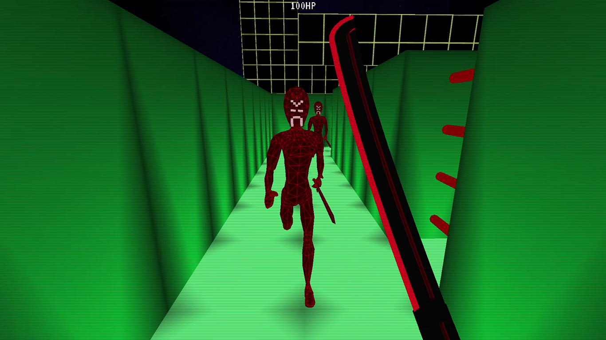

# TrippingCubes
A small engine for creating games in a voxel-based environment.
## About

There's a ton of Minecraft clones out there - not surprising, considering that it's the best-selling videogame of all times. So what does make this one special? Well... it's not about mining. It's not even a game. _Until you make it one._

TrippingCubes aims to be a toolkit for prototyping, creating and running games in a voxel-based environment - with an intuitive world editor, a completely customizable block registry, basic physics and complete non-playable character behavior - accessible through a easy-to-use JavaScript API. 

## Project state

The world editor, physics system and a simple behavior system for non-playable characters are implemented and working - the next step is to create a scripting API to control the behavior of characters and the game itself. After this is done, the next steps would be adding sound and various graphic improvements (like lighting).

## How to run

You can either download and run the [most recent release](../../releases) or - if you want to get the latest new features - build the project by yourself. As this project uses ShamanTK, you need to clone that repository into the same root directory before. See the [repository of ShamanTK](https://github.com/bauermaximilian/ShamanTK) for more details.

The game can be executed as it is - and will start loading the default world file `Default.world` and its associated configuration `Default.xml` from `Assets/Worlds`. This can be overridden with the command line parameter `/configuration:PATH/TO/CONFIG.XML` - the world file always has the same name as the configuration.

To launch the game in "creator" mode (with an in-game console on the F1 key, fly-mode with the Tab key and toggling fullscreen with the F11 key), use the command line parameter `/creator`.

## Literature and sources

The implementation of the non-playable characters was the subject of my bachelors thesis and described there in great detail. The two most important sources for the current approach were probably "Steering Behaviors For Autonomous Characters" by Craig W. Reynolds and "Artificial Intelligence For Games" by Ian Millington. 

The physics in TrippingCubes is based on the JavaScript library "voxel-physics-engine" by [Andy Hall](https://github.com/andyhall).