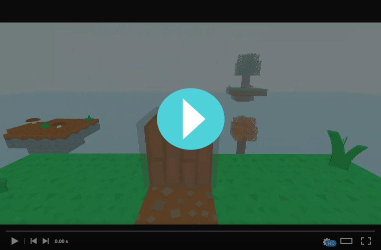

# TrippingCubes
A small engine for creating games in a voxel-based environment.
## About

There's a ton of Minecraft clones out there - not surprising, considering that it's the best-selling videogame of all times. So what does make this one special? Well... it's not about mining. It's not even a game. _Until you make it one._

TrippingCubes aims to be a toolkit for prototyping, creating and running games in a voxel-based environment - with an intuitive world editor, a completely customizable block registry, basic physics and artificial intelligence - accessible through a easy-to-use JavaScript API. 

## Project state

The world editor and physics system are implemented and working - currently, the artificial intelligence is being implemented, the scripting API will follow afterwards. Stay tuned!

## How to run

You can either download and run the [most recent release](../../releases) or - if you want to get the latest new features - build the project by yourself. As this project uses ShamanTK, you need to clone that repository into the same root directory before. See the repository of ShamanTK for more details.
